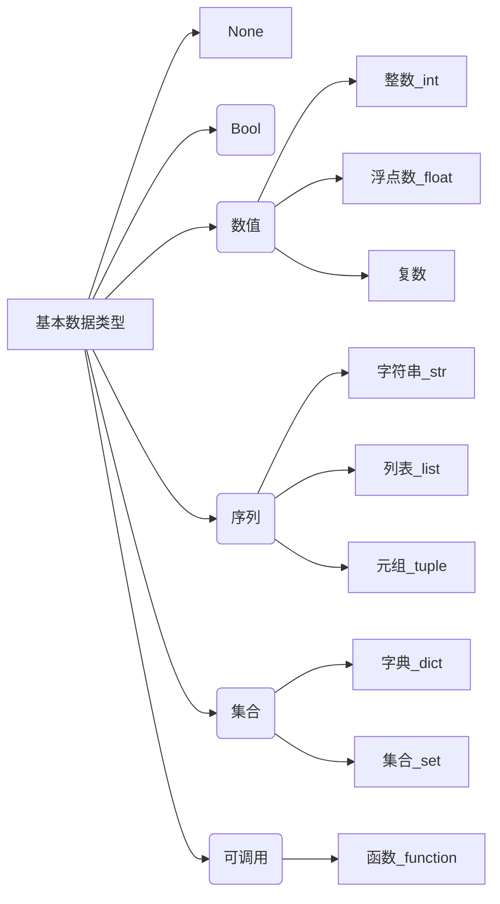

学习笔记

# 数据类型 

## 基本数据类型 

```mermaid
graph LR
基本数据类型-->None
基本数据类型-->B(Bool)
基本数据类型-->C(数值)
C --> 整数_int
C --> 浮点数_float
C --> 复数
基本数据类型-->D(序列)
D --> 字符串_str
D --> 列表_list
D --> 元组_tuple
基本数据类型-->E(集合)
E --> 字典_dict
E --> 集合_set
基本数据类型-->F(可调用)
F --> 函数_function
```

## 通用方法

# 控制流

# 函数

# 模块

~~~mermaid

~~~

